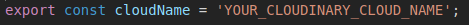

# Synergy Front End

## Front end for Synergy, a social media platform similar to twitter

## **Technologies**: Reactjs, Redux, Thunk, React Router, Cloudinary

## Setup

1. Complete setup for back end first, [github repo link](https://github.com/rakane/SocialMediaBackEnd)
2. clone directory and cd into **socialmedia-frontend**
3. run '**npm i**' in terminal
4. Create a keys.js file in '**root/src/config**' with the following information: 
5. run '**npm start**' in root directory
6. Enjoy!

## Feel free to submit any issues to github, thank you!
